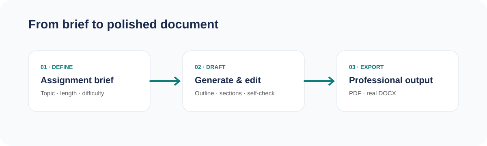
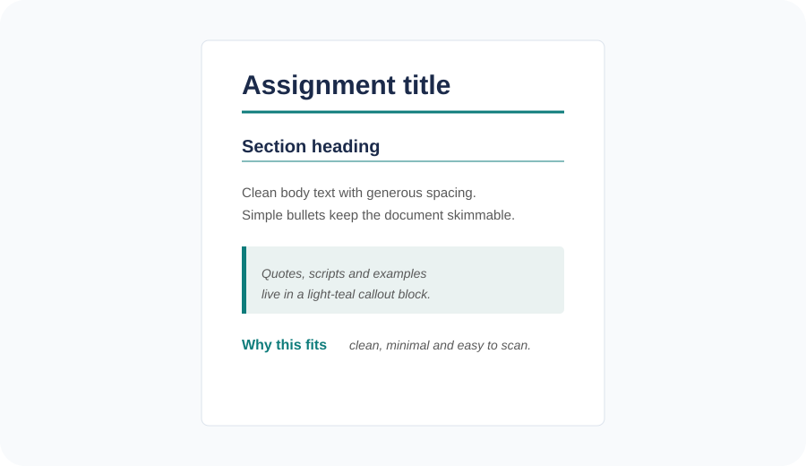

# AI Assignment Maker

A lightweight AI assignment workspace that turns a topic and brief into a structured draft, lets you edit or regenerate passages, and exports a polished PDF or **real Microsoft Word `.docx` document**.



## What it does

- **Define a brief** with topic, word count, difficulty, and extra instructions.
- **Generate section-by-section** using an outline-first workflow.
- **Edit freely** and regenerate selected passages without rewriting the whole assignment.
- **Automatic formatting** means there is no separate Markdown-formatting button or style panel.
- **Professional exports** use a consistent document design.
- **Local draft saving** keeps work in the browser with IndexedDB.
- **Images** can be uploaded or referenced by URL and included in exports.

## Document design

The Word export follows a fixed visual system so users do not have to manually tune document styles.



| Element | Style |
| --- | --- |
| Titles and H1 | Navy `#1B2A4A` |
| H2 and accents | Teal `#0E7C7B` |
| Secondary/body text | Dark grey `#595959` |
| Example/quote blocks | Mint `#EAF2F1` with teal left border |
| Page size | US Letter |
| Body alignment | Left aligned |
| Lists | Standard round bullets / numbered lists |

## Workflow

### 1. Define
Enter the assignment topic and choose the target word count and difficulty.

### 2. Draft
The backend first creates an outline and then writes each section independently. A self-check is run against the brief and word count. The resulting draft remains fully editable.

### 3. Export
Formatting is applied automatically when moving to the export step. PDF and DOCX are generated from the structured draft. There is no fake `.doc` extension: the Word download is generated with the [`docx`](https://www.npmjs.com/package/docx) library.

## Tech stack

- React 19
- Vite
- Tailwind CSS
- Vercel serverless API
- AI generation through the project's AI client layer
- `docx` for native Word document generation
- `@react-pdf/renderer` for PDF generation
- IndexedDB for local drafts
- `react-markdown` for the in-app preview

## Project structure

```text
src/
├── components/
│   ├── AssignmentWizard.jsx
│   ├── Step1Topic.jsx
│   ├── Step2Edit.jsx
│   ├── Step3Style.jsx
│   ├── ExportButton.jsx
│   ├── ExportDocxButton.jsx
│   └── PDFDocument.jsx
├── lib/
│   ├── apiClient.js
│   ├── db.js
│   ├── document.js
│   └── text.js
└── App.jsx

api/
└── generate.js

docs/
├── workflow.svg
└── document-style.svg
```

## Local development

### Requirements

- Node.js 18+
- npm
- API credentials required by the project's AI client configuration

### Install

```bash
npm install
```

### Configure

Copy the example environment file and add the required values:

```bash
cp .env.example .env.local
```

### Run

```bash
npm run dev
```

The Vite development server will show the local application URL in the terminal.

## Validation

```bash
npm run build
npm run lint
npm test
```

## Export details

### DOCX

DOCX files are generated programmatically with `docx`. The generator creates actual Word paragraphs, headings, bullets, numbering, borders, shading, and embedded images. The result is a native `.docx` package that can be opened and edited in Microsoft Word, LibreOffice, and compatible editors.

### PDF

PDF export uses `@react-pdf/renderer` and follows the same navy/teal visual direction with a US Letter page size.

## Privacy

Draft state is stored locally in the browser. AI generation requests are sent through the configured backend API so provider credentials do not need to be exposed in the browser.

## License

Add the project's preferred license here before publishing publicly.

## Recent workspace updates

- SaaS-style three-step progress workspace matched to the homepage visual language.
- Step 2 keeps generated content as plain text while formatting is applied automatically at review time.
- Step 3 includes a live cover-page and document preview.
- Academic cover page supports student, subject, course, instructor, university, date, and optional university logo.
- Automatically generated table of contents follows the assignment's section structure.
- Uploaded figures can be positioned by AI based on section relevance, with manual size and alignment controls retained.
- PDF and DOCX exports share the same navy, teal, grey, mint, cover, TOC, heading, quote, list, and image structure.
- Generation prompts use a concise natural-writing guide based on the included humanizer reference, preserving facts while avoiding common formulaic AI-writing patterns. fileciteturn2file0L23-L26
